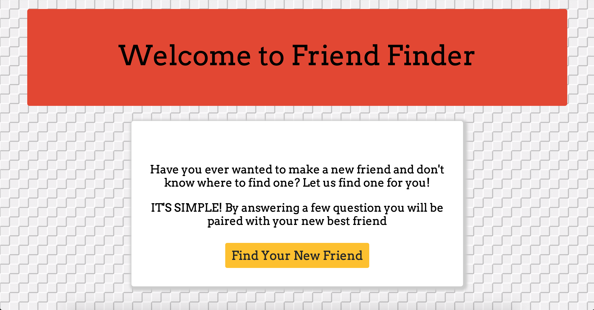
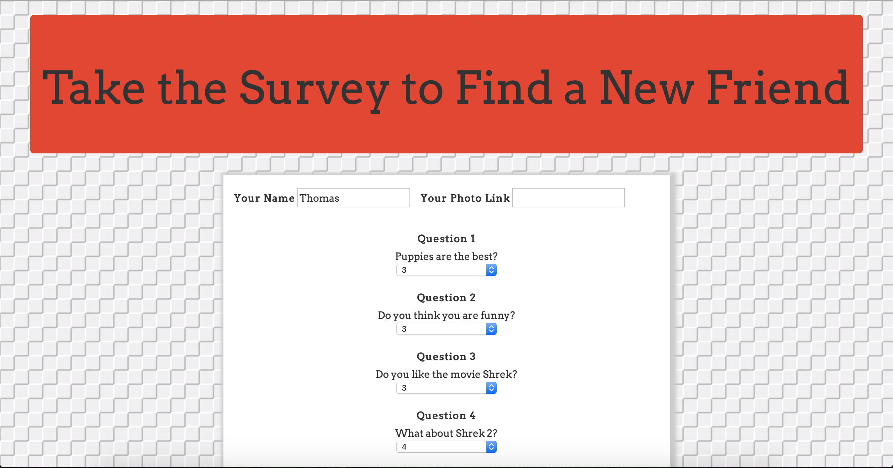
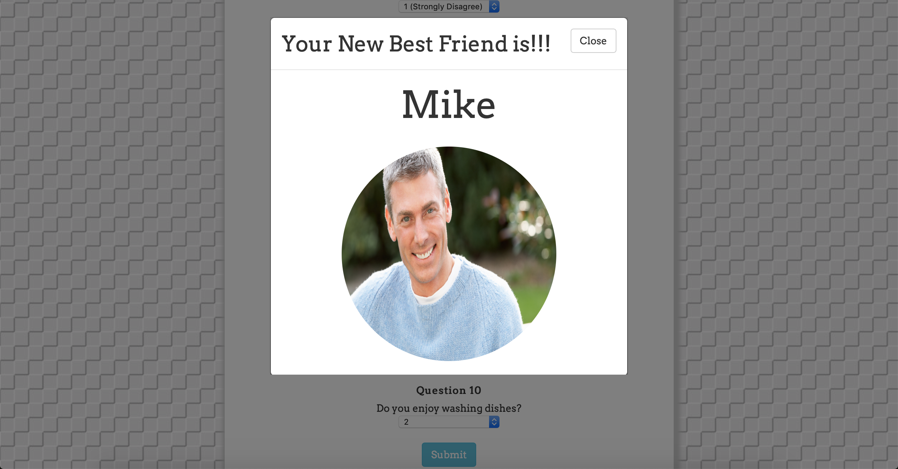

# Friend Finder Application

## Description

The Friend Finder application will help you find your new best friend. By answering questions on a scale from 1 (Strongly Disagree) to 5 (Strongly Agree) the best possible friend match will be selected. The new friend is determined be comparing absolute differences of the scores of each question with the friends already in the database. Those scores are added up and the totals with the lowest absolute difference are paired as best friends. The user is then notified who there new best friend is going to be.

## Home Page

## Survey Screen

## New Best Friend Notification

## Installation

To install the application follow the instructions below:

	git clone https://github.com/duncanfgmoore/FriendFinder.git
	cd FriendFinder
	npm install
	
## Running Locally

To run the application locally and access it in your browser, first set the `PORT` environment variable to the value of your choice. An example is shown below.

	export PORT=8080
	
After the `PORT` environment variable has been set, run the Node.js application with the command below.

	node server.js
	
The application will now be running locally on `PORT`, in this case that is port 8080. You can then access it locally from your browser at the URL `localhost:PORT`, in this case `localhost:8080`.
